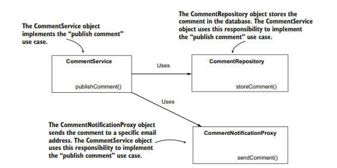

# Anotacoes Completas

# Spring no mundo real

## O que são frameworks?

No começo da história do desenvolvimento de software, cada aplicação era feita do completo zero, os tornando únicos. Com o passar do tempo, foi possível perceber um certo padrão de funcionalidades que uma aplicação utilizava, como:

- Logar mensagens de erro/info/warn;
- Usar transações para mudanças em dados;
- Mecanismos de segurança comuns;
- Maneiras de comunicação de aplicação com aplicação;

entre outros.

Sendo assim, também perceberam que as regras de negócio se tornaram a menor parte do código, que era ocupado, em sua maior parte, por aquilo que podia se considerar o “motor” da aplicação.

Com isso, vieram os frameworks, que prometem diminuir substancialmente o gasto de tempo/esforço com requisitos genéricos e essenciais de uma aplicação, permitindo maior gasto nas regras de negócio.

## O que é o Spring

Normalmente se refere ao Spring como um Framework, mas é um pouco mais complexo que isso. Spring é um ecossistema de frameworks, dividido em: Spring Core, Spring MVC, Spring Data Access e Spring testing.

### Spring Core

O Spring core é a parte que provê os mecanismos fundamentais de integração em apps. O funcionamento do Spring se baseia na Inversion of Control (IoC). Ou seja, o controle da aplicação não é do próprio código, e sim do framework (Spring). Nós apenas dizemos para o Spring como o app deve ser controlado, daí vem a inversão.

### Spring Data Access

No Spring, é o Spring Data Access quem permite a persistência de dados. Ele inclui, através do uso do JDBC, a integração com frameworks ORM como o Hibernate e o gerenciamento de transações.

### Spring MVC

As aplicações que usam Spring normalmente são aplicativos web e, dentro do ecossistema Spring é possível encontrar diversas ferramentas para lidar com esses tipos de aplicação. Uma delas é o Spring MVC, que permite o desenvolvimento de apps web da maneira servlet padrão.

### Spring testing

O Spring testing oferece uma gama de ferramentas para escrever testes de unidade e testes de integração.

### Projetos do ecossistema Spring

O Spring também possui projetos independentes, como Spring Data, Spring Security, Spring Cloud, Spring Batch, Spring Boot, etc. Ao desenvolver um app, é possível utilizar mais de um projeto em conjunto. Alguns deles são:

- Spring Data: o Spring Data permite a conexão rápida com databases e o uso de uma camada de persistência com uma mínima quantidade de linhas escritas. O projeto se refere tanto a SQL quanto NoSQL.
- Spring Boot: o Spring Boot introduz o conceito de “convenção sobre configuração”. A ideia principal do projeto é oferecer configurações padrões do framework, permitindo a customização conforme necessário. Ou seja, ao invés de escrever todas as configurações de um app qualquer, é mais eficiente utilizar convenções famosas e já estabilizadas e apenas alterar o que for necessário.

## Spring no Mundo Real

Por mais que o Spring apareça majoritariamente para desenvolvimento de aplicativos back-end, ele também se faz presente em alguns outros tipos de desenvolvimento:

### Aplicação de testes automatizados

É possível que um aplicativo de testes utilize o Spring IoC Container para gerenciar componentes, bem como utilizar o Spring Data para conectar em databases ou simplesmente usar o Spring para chamadas de endpoints REST.

### Aplicativos de Desktop

Também é possível que um app para desktop use o Spring IoC Container para gerenciar suas instâncias de objetos, facilitando a implementação e manutenabilidade. Também é possível utilizar as ferramentas do Spring para outras soluções.

### Aplicativos Mobile

É raro, mas o spring-android provê um cliente REST para android, além de suporte de autenticação para acessar APIs seguras.

## Quando não utilizar um Framework

Em algumas situações específicas, pode ser que utilizar um framework pode não ser o cenário ideal, como por exemplo:

- Aplicativos leves: quando se há a necessidade de diminuir ao máximo o tamanho (pegada) de um app, adicionar dependências pesadas como frameworks é indesejado. Um caso seria funções server-less.
- Aplicativos de segurança extrema: quando se há a necessidade de fazer aplicações cuja segurança deve ser levada ao máximo, utilizar frameworks não é a opção ideal, já que podem possuir vulnerabilidades específicas que fogem do controle dos desenvolvedores.
- Custo-benefício baixo: quando já se possui um app que não foi feito utilizando um framework, pode ser que o gasto para utilizar um seja maior que os benefícios gerados.

# Definindo beans

Beans são instâncias de objetos que são controlados pelo Spring.

### Adicionando Beans com a annotation `@Bean`

Para adicionar Beans com a anotação `@Bean`, é necessário três passos:

1. Criar uma classe de configuração para o projeto, usando a annotation `@Configuration` .
2. Adicionar um método à classe de configuração que retorne a instância de um objeto da classe que queremos definir como Bean, por exemplo:
    
    ```java
    @Configuration
    public class ProjectConfig {
     @Bean // Instrui o Spring a chamar esse método para inicialização e adicionar ao spring-context
     Parrot parrot() { // O nome do método se torna o nome do Bean
    	 var p = new Parrot();
    	 p.setName("Koko");
    	 return p;
    	}
    }
    ```
    
3. Fazer o spring utilizar a classe de configuração.
    
    ```java
    public class Main {
     public static void main(String[] args) {
    	 // Ao criar uma instância do Spring Context, passa a classe de configuração
    	 var context = new AnnotationConfigApplicationContext(ProjectConfig.class);
    	 
    	 Parrot p = context.getBean(Parrot.class); // Obtém a referência pelo context
    	 
    	 System.out.println(p.getName());
     }
    }
    ```
    

É possível definir mais de um tipo de Bean para uma mesma classe:

```java
@Configuration
public class ProjectConfig {
 @Bean
 @Primary // Define que, se nao for passado uma instância específica na criação, a instância a ser criada é parrot1
 Parrot parrot1() {
	 var p = new Parrot();
	 p.setName("Koko");
	 return p;
 }
 @Bean
 Parrot parrot2() {
	 var p = new Parrot();
	 p.setName("Miki");
	 return p;
 }
 @Bean
	Parrot parrot3() {
		var p = new Parrot();
		p.setName("Riki");
		return p;
	}
}
```

Entretanto, precisaremos especificar qual instância queremos utilizar quando chamamos a criação de um Bean. Para isso, é necessário explicitar o nome da instância, como:

```java
Parrot p = context.getBean("parrot2", Parrot.class);
```

Assim o Spring consegue definir de qual instância estamos falando. Para alterar o nome da instância, é possível utilizar um argumento na anotação do Bean, como:

```java
@Bean(name = "miki")
@Bean(value = "miki")
@Bean("miki")
```

### Adicionando Beans com *stereotype annotations*

Com anotações de estereótipo, é possível definir Beans com menos menos código, é necessário dois passos:

1. Usar a annotation `@Component` na classe que queremos adicionar suas instâncias ao contexto do Spring.
    
    ```java
    @Component
    public class Parrot {
     private String name;
     
     public String getName() {
    	 return name;
     }
     
     public void setName(String name) {
    	 this.name = name;
     }
    }
    ```
    
2. Usar a annotation `@ComponentScan` na classe de configuração.
    
    ```java
    public class Main {
     public static void main(String[] args) {
    	 var context = new AnnotationConfigApplicationContext(ProjectConfig.class);
    	 Parrot p = context.getBean(Parrot.class);
    	 System.out.println(p);
     }
    }
    ```
    

Nos casos do mundo real é bem mais comum de utilizarmos esse tipo de definição de beans, já que é necessário escrever menos código. Entretanto, utilizando a annotation @Bean você possui mais controle sobre a criação da instância que é adicionada ao Spring-context (além de outros benefícios, como definição de mais um Bean e Beans de tipos primitivos). Apesar de que, em stereotype annotations é possível utilizar a annotation `@PostConstruct` para isso.

### Adicionando Beans programaticamente

A partir do Spring 5, é possível adicionar Beans programaticamente, que permite adicionarmos novas instâncias ao contexto diretamente. Para isson é necessário chamar o método `registerBean()`, cuja assinatura é:

```java
<T> void registerBean(
 String beanName,
 Class<T> beanClass,
 Supplier<T> supplier,
 BeanDefinitionCustomizer... customizers);
```

Um exemplo seria:

```java
public class Main {
 public static void main(String[] args) {
	 var context = new AnnotationConfigApplicationContext(ProjectConfig.class);
	 
	 Parrot x = new Parrot(); // Cria a instância a ser adicionada ao contexto
	 x.setName("Kiki");
	 
	 Supplier<Parrot> parrotSupplier = () -> x; // Define um supplier para retornar a instância
	 
	 context.registerBean("parrot1", Parrot.class, parrotSupplier); // Chama o método com seus parâmetetros
	 
	 Parrot p = context.getBean(Parrot.class);
	 System.out.println(p.getName());
 }
}
```

# Relacionando Beans

Em programação orientada a objetos, é comum que um objeto tenha que delegar responsabilidades a outros. Isso não é diferente no Spring, e há duas principais maneiras de estabelecer relações no framework:

1. Chamar diretamente o método de construção (wiring).
2. Permitir que o Spring nos entregue um valor usando um parâmetro de método (auto-wiring).

## Implementando relações entre Beans definidos com `@Bean`

Dentro de Beans definidos com `@Bean`, possuímos duas maneiras de estabelecer relações:

1. Usando chamada direta.
2. Usando os parâmetros do método da annotation `@Bean`.

### Chamada direta

Podemos definir uma relação entre dois Beans com uma chamada direta do construtor que queremos relacionar, por exemplo:

```java
@Configuration
public class ProjectConfig {

 @Bean
 public Parrot parrot() {
	 Parrot p = new Parrot();
	 p.setName("Koko");
	 
	 return p;
 }
 
 @Bean
 public Person person() {
	 Person p = new Person();
	   p.setName("Ella");
		 p.setParrot(parrot());
		 
		 return p;
 }
}
```

É comum pensarmos que, ao utilizar a chamada direta, duas instâncias de uma mesma classe são criadas. Entretanto, o Spring é inteligente o suficiente para entender que, caso já tenha uma instância com as mesmas características inseria no contexto, ele apenas atribui a referência para a segunda chamada do construtor.

### Utilizando os parâmetros

Uma alternativa para definir relações de Beans é adicionar um parâmetro ao método da annotation, o tipo do parâmetro deve ser a classe a ser relacionada. Um exemplo seria:

```java
@Configuration
public class ProjectConfig {
 @Bean
 public Parrot parrot() {
	 Parrot p = new Parrot();
	 p.setName("Koko");
	 
	 return p;
 }
 
 @Bean
 public Person person(Parrot parrot) {
	 Person p = new Person();
	 p.setName("Ella");
	 p.setParrot(parrot);
	 
	 return p;
 }
}
```

Dessa maneira, ao realizar a chamada do método `person()`, o Spring sabe que tem de procurar por uma instância de parrot para injetar no parâmetro do método. Ao dizer injetar, me refiro ao conceito de *dependency injection* (DI), cuja ideia é deixar com que o Spring injete o valor dentro de um campo ou referência específica. O DI é uma aplicação do princípio de IoC, que implica em, no tempo de execução, entregar o controle da aplicação ao framework.

## Implementando relações com a *annotation* `@Autowired`

Usando a *annotation* `@Autowired`, marcamos uma propriedade de um objeto onde queremos que o Spring injete um valor do contexto. Essa marcação é utilizada diretamente na classe que definimos que o objeto precisa da dependência. Há três maneiras de se utilizar essa *annotation:*

1. Injetar o valor no campo da classe.
2. Injetar o valor pelos parâmetros do construtor.
3. Injetar o valor através de um setter.

### Injetando o valor pelo campo da classe

Essa é a mais simples das três maneiras de definir uma dependência com `@Autowired`, basta utilizar a *annotation* acima do campo, por exemplo:

```java
@Component
public class Person {
 private String name = "Ella";
 
 @Autowired
 private Parrot parrot;
}
```

Entretanto, essa abordagem é mais utilizada em exemplos, testes de unidades e PoCs, não sendo muito comum em códigos de produção. Isso se dá principalmente por dois motivos:

1. Não é possível definir campos `@Autowired` como `final`.
2. É mais difícil de gerenciar o valor na inicialização.

### Injetando o valor pelo construtor

Definir a dependência através do construtor é a maneira mais recomendada para códigos de produção, já que inibe os dois motivos ruins abordados anteriormente. Um exemplo desse tipo de abordagem seria:

```java
@Component
public class Person {
 private String name = "Ella";
 private final Parrot parrot;
 
 @Autowired
 public Person(Parrot parrot) {
	 this.parrot = parrot;
 }
}
```

Desde o Spring 4.3, caso tenha apenas um construtor definido na classe, é possível omitir a escrita da *annotation* `@Autowired`.

### Injetando o valor pelo Setter

Essa abordagem é a menos recomendada, normalmente sendo encontrada em apps antigos e códigos legados. Ela também não permite definir o campo como `final` e piora a legibilidade do código. Um exemplo seria:

```java
@Component
public class Person {
 private String name = "Ella";
 private Parrot parrot;

 @Autowired
 public void setParrot(Parrot parrot) {
	 this.parrot = parrot;
 }
}
```

## Lidando com dependências circulares

Dependência circular, em Spring, é uma situação em que, para criar o Bean A, é necessário criar o Bean B, que por sua vez também depende do Bean A. Ou seja, para criar A é necessário criar B, que também depende da criação de A, deixando o Spring preso. Um exemplo seria:

```java
@Component
public class Person {
 private final Parrot parrot;
 
 @Autowired
 public Person(Parrot parrot) {
	 this.parrot = parrot; // Person depende de parrot
 }
}

public class Parrot {
 private String name = "Koko";
 
 private final Person person;
 
 @Autowired
 public Parrot(Person person) {
	 this.person = person; // Parrot depende de person
 }
}
```

## Escolhendo dentre múltiplos Beans no Spring context

Caso tenha mais de um Bean do mesmo no contexto do Spring, o framework pode reagir de diferentes maneiras, a depender da sua implementação. Essas maneiras são:

1. Caso o identificador do parâmetro seja o mesmo que o nome de um dos Beans do contexto, o Spring o escolherá.
    
    ```java
    @Configuration
    public class ProjectConfig {
     @Bean
     public Parrot parrot1() {
    	 Parrot p = new Parrot();
    	 p.setName("Koko");
    	 
    	 return p;
     }
     
     @Bean
     public Parrot parrot2() {
    	 Parrot p = new Parrot();
    	 p.setName("Miki");
    	 
    	 return p;
     }
     
     @Bean
     public Person person(Parrot parrot2) {
    	 Person p = new Person();
    	 p.setName("Ella");
    	 p.setParrot(parrot2); // O Bean parrot2 será escolhido
    	 
    	 return p;
     }
    }
    ```
    
2. Caso não tenha um Bean com mesmo nome do identificador do parâmetro, há as seguintes opções:
    1. Caso algum Bean tenha sido marcado com `@Primary`, ele será escolhido;
    2. É possível explicitar a escolha de um Bean através da *annotation* `@Qualifier`.
        
        ```java
        @Component
        public class Person {
         private String name = "Ella";
         private final Parrot parrot;
         
         public Person(@Qualifier("parrot2") Parrot parrot) {
        	 this.parrot = parrot;
         }
        }
        ```
        
    3. Caso nenhuma dessas opções aconteça, o Spring lança uma exceção.

# Abstraction

A Abstração é um dos pilares da programação orientada a objetos, já que permite o desacoplamento. Em Spring, ela também é importante

## Usando Interfaces para definir contratos

Interface é uma estrutura abstrata que é utilizada para declarar uma responsabilidade específica, forçando todos os objetos que a implementam a definir essa responsabilidade.

### Interfaces para desacoplar implementações

Interfaces podem ajudar no desacoplamento de implementações ao limitar as delegações de responsabilidades a apenas definirem o que querem que aconteça, deixando o como para o objeto a quem foi delegado.

### Exemplo real sem uso de frameworks

Em um caso onde um app de gerenciamento de tarefas permite que os usuários deixem comentários em tarefas. Quando um usuário publica um comentário, ele é armazenado em um db e é enviado um email para um endereço configurado no app.

A escolha por implementar diretamente as classes CommentService (onde está as regras de negócio), CommentRepository (onde há o armazenamento no banco de dados) e CommentNotificationProxy (conexão com serviço externo para enviar o e-mail), torna o acoplamento alto, já que para cada novo tipo de armazenamento (diferentes dbs) ou novo serviço de envio de notificação (whatsapp por exemplo) seria necessário criar um novo objeto.



Sendo assim, é melhor organizar o repository do comentário, bem como o proxy de notificação externa como interfaces, permitindo que o service apenas deixe claro que quer que o comentário seja armazenado e que uma notificação seja enviada, sem se preocupar em como isso seria feito.


## Usando *dependency injection* com abstrações

Já observamos que o Spring consegue setar os valores dos Beans para classes concretas, mas o framework também consegue entender abstrações.

### Decidindo quais objetos devem fazer parte do contexto do String

Apenas objetos que possuem uma dependência ou é uma dependência devem ser inseridos no contexto do Spring. Adicionar objetos que não se envolvem em nenhum relacionamento pode adicionar complexidade sem necessidade ao código. Partindo dessa ideia, também não faz sentido definirmos uma interface como Bean, sendo que ela não possuiria objetos para o Spring controlar.

### Escolhendo dentro múltiplas implementações de uma abstração

Caso haja mais de um objeto que implemente uma abstração, e algum outro objeto tenha essa abstração como dependência, o Spring seleciona o objeto com base nas *annotations* `@Primary` e `@Qualify`, da mesma maneira que as classes concretas, conforme abordado no Cap 3 (Escolhendo dentre múltiplos Beans no Spring context).

### Focando nas responsabilidades do objeto com *stereotype annotations*

É possível explicitar para o Spring qual a responsabilidade do objeto quando definimos uma classe como Bean, como é o caso das *annotations* `@Service` e `@Repository` que, no exemplo anterior, ficariam assim:


# Bean scopes e ciclo de vida

O Spring possui múltiplas abordagens para criar beans e gerenciar seu ciclo de vida, chamamos essas abordagens de escopo. Os dois escopos mais utilizados são: *singleton* e *prototype*.

## Escopo Singleton

O escopo *singleton* é a abordagem padrão do Spring para gerenciar beans no seu contexto.

### Como beans *singleton* funcionam

Ao contrário do padrão de design com mesmo nome, o escopo *singleton* permite mais de uma instância para um mesmo tipo, sendo único apenas por nome e permitindo definições como:

```java
@Configuration
public class ProjectConfig {

	@Bean
	public CommentService commentService1() {
		return new CommentService();
  }
  
	@Bean
  public CommentService commentService2() {
		return new CommentService();
  }
}
```

Sendo assim, nesse escopo, `commentService1` terá apenas um bean no contexto do spring, assim como `commentService2` terá outro bean diferente, mas também único para o seu nome. Para exemplificar essa abordagem, vamos definir um Bean utilizando a annotation `@Bean`:

```java
@Configuration
public class ProjectConfig {
	@Bean
	public CommentService commentService() {
		return new CommentService();
	}
}
```

Sendo que, ao atribuir à duas variáveis diferentes a referência para CommentService, elas possuirão a mesma referência:

```java
public class Main {
	public static void main(String[] args) {
	var c = new AnnotationConfigApplicationContext(ProjectConfig.class);
	
	var cs1 = c.getBean("commentService", CommentService.class);
	var cs2 = c.getBean("commentService", CommentService.class);
	
	boolean b1 = cs1 == cs2;
 
	System.out.println(b1); // true
}
```

### Beans *singleton* no mundo real

Aplicativos no mundo real podem ser executados em múltiplas threads, onde a mesma instância de um objeto é partilhado entre elas. Caso essas threads resolvam alterar a instância, podemos encontrar um cenário de *race-condition*, onde mais de uma thread tenta alterar a mesma instância. Esse cenário pode ser tratado utilizando sincronia de threads, mas pode afetar drasticamente a performance do app.

Sendo assim, beans *singleton* não são recomendados para beans mutáveis. Esse é um dos motivos que tornam a injeção por construtor (definida no capítulo 3) como a mais recomendada nos casos gerais, já que permite a definição dessas dependências como `final`, tornando-as imutáveis.

### *Eager* e *lazy instatiantions*

Por padrão, o Spring cria todas as suas instâncias quando é inicializado, isso é chamado de *eager instatiation*. Entretanto, é possível definir que o Spring apenas crie instâncias quando é necessário, ou seja, quando alguém se refere àquele bean. Essa segunda abordagem é chamada *lazy instatiation*.

No geral, é mais recomendado utilizar a instanciação padrão *Eager*, já que o custo performático de sempre checar se o objeto existe para saber se deve instanciá-lo normalmente não justifica o ganho de memória. Além de que, caso algum Bean tenha problemas para inicializar, é bom que vejamos diretamente quando o Spring inicia. Entretanto, em alguns casos específicos onde parte do app não será utilizado em certos clientes ou versões, é justificável o uso da *annotation* `@Lazy`, que define que aquele bean utilizará a instanciação *lazy*, como descrito no exemplo a seguir:

```java
@Service
@Lazy
	public class CommentService {
	public CommentService() {
		System.out.println("CommentService instance created!");
	}
}
```

## Escopo *prototype*

### Como beans *prototype* funcionam

Ao contrário do escopo *singleton*, no escopo *prototype* sempre que for pedido ao Spring uma nova referência a um bean, uma nova instância será criada. Para definir um bean como *prototype*, basta usar a *annotation* `@Scope`, e passar como parâmetro a definição `SCOPE_PROTOTYPE()`, como por exemplo:

```java
@Configuration
public class ProjectConfig {
	@Bean
	@Scope(BeanDefinition.SCOPE_PROTOTYPE)
	public CommentService commentService() {
		return new CommentService();
	}
}
```

### Beans *prototype* no mundo real

Seguindo a mesma ideia de múltiplas threads apresentada no *singleton*, utilizamos beans *prototype* quando alguma classe que use o bean como dependência precisa mudar algum de seus atributos, evitando a *race-condition*. Um exemplo seria:

```java
@Component
@Scope(BeanDefinition.SCOPE_PROTOTYPE)
public class CommentProcessor {
	@Autowired
	private CommentRepository commentRepository;

}
```

E sua chamada dentro do `CommentService` seria:

```java
@Service
	public class CommentService {
	@Autowired
	private ApplicationContext context;
	
	public void sendComment(Comment c) {
	CommentProcessor p = context.getBean(CommentProcessor.class);
	
	p.setComment(c);
	p.processComment(c);
	p.validateComment(c);
	c = p.getComment();
	
	}
}
```

É necessário manter-se atento para não injetar o bean *prototype* diretamente em uma classe *singleton.* Isso faria com que o Spring injetasse a dependência apenas uma vez, quebrando o conceito de se usar o escopo *prototype*. Um exemplo desse caso seria:

```java
@Service
	public class CommentService {
	@Autowired
	private CommentProcessor p; // Dessa maneira o Spring injeteria CommentProcessor na sua criação, mas CommentService só é criado 1x
	
	public void sendComment(Comment c) {
	
	p.setComment(c);
	p.processComment(c);
	p.validateComment(c);
	c = p.getComment();

	}
}
```

# Aspects

*Aspects* são maneiras do framework interceptar uma chamada de um método e possivelmente alterando sua execução.

## Como *aspects* funcionam no Spring

Um *aspect* é apenas uma lógica que o framework executa quando chamamos um método específico. Quando projetamos um *aspect*, estamos defindo:

- **Aspect**: O código a ser executado na chamada de um método específico.
- **Advice**: Quando o app deveria executar a lógica do aspect, por exemplo: antes ou depois da execução do método.
- **Pointcut**: Quais métodos serão interceptados pelo framework.

Também existem os *join points*, que definem o evento que deslanchará a execução do *aspect*. Entretanto, no Spring os *join points* são sempre métodos.

Para que o spring seja capaz de interceptar um método, o objeto deve ser um bean. Quando um bean que é um alvo de *aspect* é refernciado, o Spring retorna um intermediador, um *proxy*, ao invés do bean real. Essa abordagem se chama *weaving*.

Nessa lógica, ao chamar um método interceptado, o *proxy* executa a lógica implementada no *aspect*, e depois delega a chamada do método real.

## Implementando a*spects* com AOP do Spring

Iremos utilizar como exemplo

### Implementando um *aspect* simples

Para criar um *aspect*, são necessário quatro passos:

1. Habilitar o mecanismo do *aspect* adicionando a *annotation* `@EnableAspectJAutoProxy`.
    
    ```java
    @Configuration
    @ComponentScan(basePackages = "services")
    @EnableAspectJAutoProxy
    public class ProjectConfig {}
    ```
    
2. Criar uma nova classe, definir como bean e utilizar a *annotation* `@Aspect`.
    
    Um *aspect* de log seria:
    
    ```java
    @Aspect
    public class LoggingAspect {
    	public void log() {
    		// ainda será implementado
    	}
    }
    
    // definir como bean de qualquer maneira
    ```
    
3. Definir o método que será implementado a lógica e dizer ao Spring quais métodos e quando interceptá-los.
    
    Para isso, usamos as *advice annotations*, um exemplo:
    
    ```java
    @Aspect
    public class LoggingAspect {
    	@Around("execution(* services.*.*(..))")
    	public void log(ProceedingJoinPoint joinPoint) {
    		joinPoint.proceed(); // delega ao execução ao método normal
    	}
    }
    ```
    
    A *annotation* `@Around` permite performar uma lógica antes e depois do método. O parâmetro dessa *annotation* define quais métodos esse *aspect* interceptará, nesse caso, todos os métodos do pacote services, sejam quaisquer seus tipos de retorno, classes, nomes e parâmetros.
    
4. Implementar a lógica do *aspect*.
    
    Por fim, basta implementar a lógica necessária. Como:
    
    ```java
    @Aspect
    public class LoggingAspect {
    	private Logger logger = Logger.getLogger(LoggingAspect.class.getName());
    	
    	@Around("execution(* services.*.*(..))")
    	public void log(ProceedingJoinPoint joinPoint) throws Throwable {
    		logger.info("Method will execute");
    		joinPoint.proceed();
    		logger.info("Method executed");
    	}
    }
    ```
    
    O método `joinPoint.proceed()` delega a execução ao método real. Caso esse método não seja utilizado, o método real nunca é executado. Essa abordagem pode ser útil caso realmente não queiramos que o método execute, dentro de uma validação, por exemplo.
    

### Alterando parâmetros e valor retornado de métodos interceptados

O parâmetro de tipo `ProceedingJoinPoint` representa o método interceptado, com ele é possível alterar os parâmetros e o valor retornado de um método interceptado por um *aspect*. Um exemplo seria: 

```java
@Aspect
public class LoggingAspect {
	private Logger logger = Logger.getLogger(LoggingAspect.class.getName());
	
	@Around("execution(* services.*.*(..))")
	public Object log(ProceedingJoinPoint joinPoint) throws Throwable {
		String methodName = joinPoint.getSignature().getName();
		Object [] arguments = joinPoint.getArgs();
		
		logger.info("Method " + methodName +
								" with parameters " + Arrays.asList(arguments) +
								" will execute");
		
		Object returnedByMethod = joinPoint.proceed();
		logger.info("Method executed and returned " + returnedByMethod);
		return returnedByMethod;
	}
}
```

Onde `joinPoint.getSignature().getName()` retorna o nome do método, `joinPoint.getArgs()` retorna os argumentos e `joinPoint.proceed()` delega ao método real e retorna o valo retornado pelo método real.

Além disso, o valor retornado pela chamada original do método é o valor definido no *aspect*.

Por fim, é possível alterar os parâmetros da chamada original do método através do `proceed()`, onde seus parâmetros serão os parâmetros da execução do método real e, caso estejam vazios, se mantem os mesmos parâmetros da chamada original.

### Interceptando métodos *annotated*

É possível criar uma *annotation* customizada para definir quais métodos queremos interceptar. Para isso, são necessários dois passos:

1. Definir uma *annotation* customizada e torná-la acessível em tempo de execução.
    
    ```java
    @Retention(RetentionPolicy.RUNTIME) // permite que a annotation seja interceptada em tempo de execução
    @Target(ElementType.METHOD) // restringe para ser utilizada apenas com métodos
    public @interface ToLog {}
    ```
    
2. Utilizar uma *pointcut expression* para que o método do *aspect* conte a ele quais métodos interceptar.
    
    ```java
    @Aspect
    public class LoggingAspect {
    	@Around("@annotation(ToLog)")
    	public Object log(ProceedingJoinPoint jp) {}
    }
    ```
    
    Dessa maneira, a *pointcut expression* `"@annotation(ToLog)"` define que o método `log(ProceedingJoinPoint jp)` será executado ao interceptar métodos com a *annotation* `@ToLog`.
    

### Algumas outras *advice annotations*

Utilizar a *annotation* `@Around` permite flexibilizar quando a lógica do *aspect* será executada ao interceptar o método, alterando a lógica como necessário.

Entretanto, caso não seja necessário essa flexibilidade, algumas *advice annotations* que podem ser úteis são:

- `@Before`: Chama a lógica do *aspect* antes da execução do método.
- `@AfterReturning`: Chama a lógica do *aspect* após o método retornar um valor, e esse valor é definido como parâmetro para o método do *aspect*. Não roda caso o método original lance uma exceção.
- `@AfterThrowing`: Chama a lógica do *aspect* após o método lançar uma exceção, e passa como parâmetro para o método do *aspect*.
- `@After`: Chama a lógica do *aspect* após a execução do método.

Nessas *annotations*, não existe o parâmetro `ProceedingJoinPoint`, e nem é possível decidir quando delegar para o método real.

## A cadeia de execução do *aspect*

Muitas vezes, um método pode ser interceptado por mais de um aspect. Quando isso acontece, eles precisam executar um após o outro, criando uma cadeia de execução. A ordem de execução é importante, pois ordens diferentes podem ter resultados diferentes. 

Por padrão, o Spring não garante a ordem de execução dos aspects. Para definir a ordem, pode-se utilizar a *annotation* `@Order`. Essa *annotation* recebe um valor numérico que representa a ordem na cadeia de execução. Quanto menor o número, mais cedo o aspect é executado (maior prioridade). Se dois *aspects* tiverem o mesmo valor, a ordem entre eles não é definida.

```java
@Aspect
@Order(1) // Executará primeiro
public class SecurityAspect {
    // ...
}

@Aspect
@Order(2) // Executará depois do SecurityAspect
public class LoggingAspect {
    // ...
}
```

Um `SecurityAspect` pode não delegar a execução em todos os casos. Se ele for executado primeiro, o `LoggingAspect` pode nunca ser executado, e a chamada não seria registrada no log.

# Entendendo Spring Boot e Spring MVC

## O que é um aplicativo web

Todo aplicativo que é acessado pelo web browser é um web app.

### Visão geral de um aplicativo web

Um aplicativo web é dividido em duas partes:

- Frontend: é a parte que o usuário interage. O web browser representa o frontend de um aplicativo web, enviando pedidos para o servidor web, recebe respostas e provê uma maneira do usuário interagir com a aplicação.
- Backend: é a parte que recebe os pedidos e retorna respostas contendo dados. O backend implementa lógica das regras de negócios e pode armazenar dados do usuário antes de enviar uma resposta.

### Diferentes modelos de implementação de um aplicativo web

Classificamos as maneiras de criar aplicativos web da seguinte maneira:

1. Aplicativos em que o backend provê uma view completa como resposta: O browser interpreta diretamente os dados recebidos e mostra as informações para o usuário.
2. Aplicativos que usam a separação frontend-backend: Nesses aplicativos o backend retorna dados crus, e o browser não os demonstra diretamente, ele executa um app frontend separadamente. Esse app processa os dados e diz para o browser o que mostrar.

É possível encontrar essas duas maneiras em aplicativos em produção. Entretanto, a separação em frontend-backend é considerada a maneira moderna de se construir um aplicativo web.

### Usando um contêiner servlet no desenvolvimento de aplicativos web

O browser (cliente) utiliza do protocolo HTTP para se comunicar com o servidor, entretanto, o Java não reconhece HTTP diretamente. Para permitir essa comunicação, utilizamos um *servlet container*, também conhecido como web server, que representa uma camada intermediária entre o aplicativo e o browser, tomando conta da comunicação. Um *servlet* nada mais é que um objeto Java controlado pelo *servlet container*, um exemplo muito utilizado de *servlet container* é o Tomcat.

## A magia do Spring Boot

Felizmente não é mais necessário configurar um *servlet container*, o Spring Boot faz isso automaticamente. Os recursos mais interessantes dessa ferramenta são:

- Simplifica a criação de projetos;
- Inicializador de dependências;
- Autoconfiguração baseada em dependências.

### Simplifica a criação de projetos

Torna possível a utilização de um inicializador de projeto para obter um esqueleto de aplicativo vazio, mas configurado.

### Inicializador de dependências

O Spring Boot agrupa certas dependências usadas com um propósito específico como dependências iniciais. Assim, não é necessário descobrir as dependências necessárias para um projeto com um propósito particular.
Antigamente era necessário definir todas as dependências de um aplicativo. Entretanto, com Spring Boot definimos um grupo de dependências, por exemplo o Spring Web, que será responsável por trazer todas as dependências em versões estáveis e compatíveis entre si.

### Autoconfiguração baseada em dependência

O Spring Boot aplica o princípio de convenção-sobre-configuração, ou seja, com base no propósito do aplicativo, representado pelas dependências utilizadas, o Spring define as configurações básicas, seguindo as maneiras mais utilizadas de configurar um app para os propósitos definidos. Isso faz ser necessário alterar apenas as configurações específicas que não condizem com suas necessidades.

Por exemplo, ao utilizar o Spring Starter Web, o Spring Boot já define uma instância do Tomcat acessível na porta 8080, já que se espera de um aplicativo web a capacidade de comunicar via HTTP.

## Implementando um web app com Spring MVC

Com o Spring Boot, começamos com um aplicativo bem configurado, mas vazio. Para criar uma página web é necessário dois passos:

1. Escrever um documento HTML com conteúdo que será mostrado ao cliente.
2. Escrever um controller com uma ação para a página web criada no ponto 1.

Um *controller* é um componente web que contém métodos (comumente chamado de ações) executados em uma requisição HTTP específica.

Para definir uma classe como controller, utilizamos a *stereotype annotation* `@Controller`. Isso também faz com que o Spring crie um bean da classe. Para definir que uma ação seja executada ao usuário entrar em uma rota específica, utilizamos a *annotation* `@RequestMapping` especificando a rota como parâmetro, por exemplo: `@RequestMapping("/home")`. Um exemplo seria:

```java
@Controller
public class MainController {
	@RequestMapping("/home")
	public String home() {
		return "home.html";
	}
}
```

Sendo assim, ao acessar a página [localhost:8080/home](http://localhost:8080/home) o método `home()` é executado, retornando o documento home.html. Entretanto, para isso acontecer, são necessários sete passos por trás dos panos:

1. O cliente faz uma requisição HTTP.
2. Tomcat pega essa requisição e chama um *servlet component*, no caso do Spring MVC, *o dispatcher servlet*.
3. O *dispatcher servlet* é o ponto de entrada para o aplicativo; Sua responsabilidade é gerenciar a requisição dentro do Spring. Ele deve encontrar qual ação do *controller* executar e enviar de volta uma resposta.
4. Para saber qual ação do *controller* executar, o *dispatcher servlet* delega ao componente *handler mapping*, que procura pela ação associada pela annotation `@RequestMapping`.
5. Após encontrar a ação, o *dispatcher* a executa, que retorna o nome da view. Se não foi possível encontrar nenhuma, ele retorna um erro 404 Not Found.
6. Agora o *dispatcher* precisa encontrar a view dentro dos conteúdos e enviar a reposta ao cliente. Para isso, ele delega a responsabilidade ao componente *View Resolver*.
7. Após encontrar, o *dispatcher* retorna a view renderizada através da resposta HTTP.


# Spring web scopes

Alguns tipos de escopos de beans são relevantes apenas em aplicativos web, eles são chamados de escopos web.

- Escopo de requisição (*request scope*): O Spring cria uma instância de uma classe bean para cada requisição HTTP. Essa instância vive apenas para aquela requisição específica.
- Escopo de sesssão (*session scope*): O Spring cria uma instância e a mantém na memória enquanto a sessão HTTP perdurar. Além disso, linka a instãncia com a sessão do cliente.
- Escopo de aplicação (*application scope*): Uma instância única no contexto, disponível enquando o app estiver executando.

Para exemplificar cada um dos escopos, construiremos uma página de login simples, que possuirá três etapas:

1. Implementar a lógica de login;
2. Manter os detalhes do usuário logado;
3. Contar as requisições de login.

## Utilizando o escopo de requisição

Esse escopo cria uma instância para cada requisição HTTP. Utilizaremos o escopo de requisição para construir a lógica do login, garantindo que as credenciais sensíveis do usuário existam apenas durante a requisição de login.

Para isso, usaremos a página HTML nomeada “login.html” a seguir:

```html
<!DOCTYPE html>
<html lang="en" xmlns:th="http://www.thymeleaf.org">
<head>
	<meta charset="UTF-8">
	<title>Login</title>
</head>
<body>
	<form action="/" method="post">
		Username: <input type="text" name="username" /><br />
		Password: <input type="password" name="password" /><br />
		<button type="submit">Log in</button>
	</form>
	<p th:text="${message}"></p>
</body>
</html>
```

O controller a seguir lida com as requisições `GET` (para exibir a página) e `POST` (para processar o formulário):

```java
@Controller
public class LoginController {
	@GetMapping("/")
	public String loginGet() {
		return "login.html";
	}
	
	@PostMapping("/")
	public String loginPost(
		@RequestParam String username,
		@RequestParam String password,
		Model model
	) {
		boolean loggedIn = false;
		
		if (loggedIn) {
			model.addAttribute("message", "You are now logged in.");
		} else {
			model.addAttribute("message", "Login failed!");
		}
		
		return "login.html";
	}
}
```

Para a lógica de login, criamos um bean `LoginProcessor` com escopo de requisição. Ele armazenará as credenciais e as validará. Por ser `@RequestScope`, cada tentativa de login terá sua própria instância, evitando problemas de concorrência e garantindo que as credenciais sejam descartadas após a requisição.

```java
@Component
@RequestScope
public class LoginProcessor {
    private String username;
    private String password;

    public boolean login() {
        String username = this.getUsername();
        String password = this.getPassword();
        if ("natalie".equals(username) && "password".equals(password)) {
            return true;
        } else {
            return false;
        }
    }
}
```

## Utilizando o escopo de sessão

O escopo de sessão cria uma instância do bean por sessão HTTP de um cliente. Isso nos permite manter informações sobre o usuário logado enquanto ele navega por diferentes páginas da aplicação.

Continuando o exemplo, após um login bem-sucedido, queremos que o usuário permaneça logado. Para isso, criamos um serviço `LoggedUserManagementService` com escopo de sessão (`@SessionScope`).

```java
@Service
@SessionScope
public class LoggedUserManagementService {
    private String username;
}
```

Modificamos o `LoginProcessor` para, em caso de sucesso, armazenar o nome de usuário no bean de sessão.

Java

```java
@Component
@RequestScope
public class LoginProcessor {
    private final LoggedUserManagementService loggedUserManagementService;
    public LoginProcessor(LoggedUserManagementService loggedUserManagementService) {
        this.loggedUserManagementService = loggedUserManagementService;
    }

    public boolean login() {
        boolean loginResult = false;
        if ("natalie".equals(username) && "password".equals(password)) {
            loginResult = true;
            loggedUserManagementService.setUsername(username);
        }
        return loginResult;
    }
}
```

Agora, em outras partes da aplicação, podemos verificar se o usuário está logado injetando `LoggedUserManagementService` e checando se o `username` não é nulo. Se um usuário não logado tentar acessar uma página restrita, podemos redirecioná-lo para a página de login.

```java
@Controller
public class MainController {
    private final LoggedUserManagementService loggedUserManagementService;
    // ...
    @GetMapping("/main")
    public String home(@RequestParam(required = false) String logout, Model model) {
        if (logout != null) {
            loggedUserManagementService.setUsername(null);
        }

        String username = loggedUserManagementService.getUsername();
        if (username == null) {
            return "redirect:/";
        }
        model.addAttribute("username" , username);
        return "main.html";
    }
}
```

Finalmente, o `LoginController` é ajustado para redirecionar para a página principal (`/main`) após um login bem-sucedido.

```java
@PostMapping("/")
public String loginPost(...) {
    boolean loggedIn = loginProcessor.login();
    if (loggedIn) {
        return "redirect:/main";
    }
    model.addAttribute("message", "Login failed!");
    return "login.html";
}
```

## Utilizando o escopo de aplicação

Um bean com escopo de aplicação é, na prática, um singleton para toda a aplicação web. Apenas uma instância do bean existe e é compartilhada por todas as requisições de todos os usuários. É importante ressaltar que seu uso é **desaconselhado para dados mutáveis** devido a problemas de concorrência (race conditions), sendo preferível usar um banco de dados.

Para demonstrar, vamos adicionar um contador de tentativas de login em nossa aplicação. Criaremos um `LoginCountService` com a anotação `@ApplicationScope`.

```java
@Service
@ApplicationScope
public class LoginCountService {
    private int count;

    public void increment() {
        count++;
    }

    public int getCount() {
        return count;
    }
}
```

Injetamos este serviço no nosso `LoginProcessor` (que é `@RequestScope`) e chamamos o método `increment()` a cada tentativa de login.

```java
@Component
@RequestScope
public class LoginProcessor {
    private final LoginCountService loginCountService;

    public LoginProcessor(..., LoginCountService loginCountService) {
        this.loginCountService = loginCountService;
    }

    public boolean login() {
        loginCountService.increment();
    }
}
```

Por fim, exibimos o contador na página principal, obtendo o valor no `MainController` e passando-o para a view.

```java
// Dentro do MainController
@GetMapping("/main")
public String home() {
    int count = loginCountService.getCount();
    model.addAttribute("loginCount", count);
    return "main.html";
}
```

# Implementando serviços REST

## Usando serviços REST para trocar dados entre apps

No Spring, um endpoint REST é apenas uma ação do controller mapeada para um método HTTP e um caminho, cuja resposta é diretamente o que o controller retorna.

Esse tipo de comunicação possui alguns pontos de atenção:

- Caso a ação do controller demore muito para completar, a chamada HTTP pode expirar e quebrar a comunicação
- Enviar grandes quantidades de dados também pode fazer a chamada HTTP pode expirar e quebrar a comunicação
- Muitas chamadas concorrentes em um endpoint pode colocar muita pressão no aplicativo e fazer com que falhe
- A conexão nunca é 100% confiável. Sempre existe a chance que um endpoint REST falhe devido à conexão

Quando implementamos uma comunicação usando REST, devemos sempre levar em conta o que nosso aplicativo fará em caso de falha de alguma chamada.

## Implementando um endpoint REST

Para implementar um endpoint REST em Spring, é necessário apenas definir que a ação do controller não retorne uma view, mas sim um dado. Para isso, basta utilizarmos a *annotation* `@RequestBody`. Um exemplo:

```java
@Controller
public class HelloController {
	GetMapping("/hello")
	@ResponseBody
	public String hello() {
		return "Hello!";
	}
}
```

Entretanto, escrever a anotação toda vez que formos implementar um endpoint não é interessante, para isso, podemos apenas definir que o controller é um controller REST, através da anotação `@RestController`. Ficaria da seguinte maneira:

```java
@RestController
public class HelloController {
	@GetMapping("/hello")
	public String hello() {
		return "Hello!";
	}
	@GetMapping("/ciao")
	public String ciao() {
		return "Ciao!";
	}
	
}
```

## Gerenciando a resposta HTTP

A resposta HTTP é como o backend envia dados de volta ao cliente. Ela contém: status da resposta, cabeçalhos (headers) e o corpo da resposta (body).

### Enviando objetos como corpo da resposta

Para enviar um objeto na resposta, basta que a ação do controller o retorne. Por padrão, o Spring converte o objeto para o formato JSON.

```java
@RestController
public class CountryController {
    @GetMapping("/france")
    public Country france() {
        Country c = Country.of("France", 67);
        return c; // Retorna um objeto Country
    }
}
```

A resposta JSON para o código acima seria:

```java
{
	 "name": "France",
	 "population": 67
}
```

### Definindo o status e os cabeçalhos da resposta

Para ter mais controle sobre a resposta, como definir um status HTTP específico ou adicionar cabeçalhos, utilizamos a classe `ResponseEntity`.

```java
@RestController
public class CountryController {
    @GetMapping("/france")
    public ResponseEntity<Country> france() {
        Country c = Country.of("France", 67);
        return ResponseEntity
            .status(HttpStatus.ACCEPTED) // Define o status para 202 Accepted
            .header("continent", "Europe") // Adiciona um cabeçalho customizado
            .header("capital", "Paris")
            .body(c); // Define o corpo da resposta
    }
}
```

### Gerenciando exceções no endpoint

Para lidar com erros, podemos separar a lógica de tratamento de exceções do controller. Uma forma limpa de fazer isso é usando um `@RestControllerAdvice`, que funciona como um *aspect* que intercepta exceções lançadas pelos controllers.

Primeiro, definimos uma classe com a anotação `@RestControllerAdvice`. Dentro dela, criamos métodos para tratar exceções específicas, anotados com `@ExceptionHandler`.

```java
@RestControllerAdvice
public class ExceptionControllerAdvice {

    @ExceptionHandler(NotEnoughMoneyException.class)
    public ResponseEntity<ErrorDetails> exceptionNotEnoughMoneyHandler() {
        ErrorDetails errorDetails = new ErrorDetails();
        errorDetails.setMessage("Not enough money to make the payment.");
        return ResponseEntity
            .badRequest() // Retorna status 400 Bad Request
            .body(errorDetails);
    }
}
```

Com isso, o controller fica mais simples, focando apenas no fluxo de sucesso, pois a exceção será capturada e tratada pelo `advice`.

```java
@RestController
public class PaymentController {
    // ...
    @PostMapping("/payment")
    public ResponseEntity<PaymentDetails> makePayment() {
        // Se processPayment() lançar NotEnoughMoneyException,
        // o @RestControllerAdvice irá tratar.
        PaymentDetails paymentDetails = paymentService.processPayment();
        return ResponseEntity
            .status(HttpStatus.ACCEPTED)
            .body(paymentDetails);
    }
}
```

## Usando o corpo da requisição para obter dados do cliente

Quando o cliente precisa enviar uma quantidade maior de dados (como um objeto complexo), utilizamos o corpo da requisição HTTP. No Spring, usamos a anotação `@RequestBody` no parâmetro da ação do controller para receber esses dados. O Spring automaticamente converte o JSON do corpo da requisição para um objeto Java.

```java
@RestController
public class PaymentController {
    @PostMapping("/payment")
    public ResponseEntity<PaymentDetails> makePayment(
        @RequestBody PaymentDetails paymentDetails) { // Recebe os detalhes do pagamento do corpo da requisição
        logger.info("Received payment " + paymentDetails.getAmount());
        return ResponseEntity
            .status(HttpStatus.ACCEPTED)
            .body(paymentDetails);
    }
}
```

# Consumindo endpoints REST

É possível utilizar três ferramentas para consumir endpoints REST:

1. OpenFeign: Ferramenta oferecida pelo projeto Spring Cloud. A solução recomendada.
2. RestTemplate: Uma ferramenta bem conhecida pelos desenvolvedores. Era a maneira mais comum de se consumir endpoints REST, mas foi descontinuada a partir do Spring 5 e será eventualmente deprecada.
3. WebClient: Um recurso do Spring apresentado como um substituto do RestTemplate. Utiliza uma abordagem de programação diferente, chamada *reactive programming*.

## Utilizando o OpenFeign

Para utilizar o OpenFeign para consumir endpoints REST, é necessário apenas definir uma interface, cujos métodos consomem um endpoint REST, e a ferramenta provê a implementação. Sendo assim, é necessário apenas anotar o método, para definir o caminho, método HTTP e eventuais parâmetros, cabeçalhos e o corpo da requisição. Um exemplo seria:

```java
@FeignClient(name = "payments", url = "${name.service.url}")
public interface PaymentsProxy {
	@PostMapping("/payment")
	Payment createPayment(@RequestHeader String requestId, @RequestBody Payment payment);
}
```

Onde na anotação `@FeignClient` nós definimos o nome do proxy e a URI base da requisição. Já no método da interface, utilizamos as mesmas anotações de definição de um endpoint REST normais do Spring para definir o caminho, método HTTP, etc. Sendo assim, para utilizarmos o proxy, basta inserirmos a ferramenta na configuração:

```java
@Configuration
@EnableFeignClients(basePackages = "com.example.proxy")
public class ProjectConfig {}
```

E chamar o proxy no controller:

```java
@RestController
public class PaymentsController {
	private final PaymentsProxy paymentsProxy;
	
	public PaymentsController(PaymentsProxy paymentsProxy) {
		this.paymentsProxy = paymentsProxy;
	}
	
	@PostMapping("/payment")
	public Payment createPayment(@RequestBody Payment payment) {
		String requestId = UUID.randomUUID().toString();
		return paymentsProxy.createPayment(requestId, payment);
	}
}
```

## Utilizando o RestTemplate

Para começo de conversa, o RestTemplate está sendo descontinuado não por ser uma ferramenta ruim, mas por não apresentar funcionalidades que os desenvolvedores frequentemente precisam:

- Chamar endpoints de maneira tanto síncrona quanto assíncrona
- Escrever menos código e tratar menos exceções
- Retentar execuções de chamadas e implementar operações de fallback

Sendo assim, para utilizar o RestTemplate são necessários três passos:

1. Definir um cabeçalho HTTP criando e configurando uma instância de `HttpHeaders`.
2. Criar uma instância `HttpEntity` que representa os dados da requisição.
3. Enviar a chamada HTTP utilizando `exchange()` e obter a resposta HTTP.

Seguindo esses passos, um exemplo de criação de um proxy utilizando essa ferramenta seria:

```java
@Component
public class PaymentsProxy {
	private final RestTemplate rest;
	
	@Value("${name.service.url}")
	private String paymentsServiceUrl;
	
	public PaymentsProxy(RestTemplate rest) {
		this.rest = rest; // Injeta o RestTemplate por constructor DI
	}
	
	public Payment createPayment(Payment payment) {
		String uri = paymentsServiceUrl + "/payment";
		
		HttpHeaders headers = new HttpHeaders(); // Cria os headers HTTP
		headers.add("requestId", UUID.randomUUID().toString()); // Insere os valores do header
		
		HttpEntity<Payment> httpEntity = new HttpEntity<>(payment, headers); // Cria a instância HTTP
		
		ResponseEntity<Payment> response = rest.exchange(uri, HttpMethod.POST, httpEntity, Payment.class); // Utiliza o método exchange para consumir o endpoint
		
		return response.getBody();
	}
}
```

Por fim, basta definir um endpoint como no exemplo da ferramenta anterior.

## Utilizando WebClient

O `WebClient` é uma ferramenta utilizada em apps que seguem a metodologia **reativa**. Embora a documentação do Spring o recomende como substituto do `RestTemplate`, essa recomendação é mais válida para aplicações reativas. Para aplicações não reativas (tradicionais), o `OpenFeign` é a melhor alternativa.

A abordagem reativa muda a forma como as threads são gerenciadas. Em vez de uma thread ficar bloqueada esperando por uma operação de I/O (como uma chamada de rede), ela é liberada para executar outras tarefas. Quando a operação de I/O termina, o fluxo é retomado, otimizando o uso de recursos. A comunicação se dá por meio de *producers* (geralmente `Mono` ou `Flux`) e *subscribers*.

Para usar o `WebClient`, a dependência `spring-boot-starter-webflux` é necessária em vez da `spring-boot-starter-web`. Primeiro, criamos um bean de `WebClient`:

```java
@Configuration
public class ProjectConfig {
    @Bean
    public WebClient webClient() {
        return WebClient.builder().build();
    }
}
```

A implementação do proxy usa uma API fluente para construir a requisição. Note que o método não retorna o objeto `Payment` diretamente, mas sim um `Mono<Payment>`, que é o *producer* do resultado.

```java
@Component
public class PaymentsProxy {
    private final WebClient webClient;

    @Value("${name.service.url}")
    private String url;

    public PaymentsProxy(WebClient webClient) {
        this.webClient = webClient;
    }

    public Mono<Payment> createPayment(String requestId, Payment payment) {
        return webClient.post() // Define o método HTTP
            .uri(url + "/payment") // Define a URI
            .header("requestId", requestId) // Adiciona o header
            .body(Mono.just(payment), Payment.class) // Define o corpo da requisição
            .retrieve() // Envia a requisição
            .bodyToMono(Payment.class); // Obtém o corpo da resposta como um Mono
    }
}
```

O controller que utiliza este proxy também será reativo, recebendo e retornando objetos `Mono`, permitindo que o framework gerencie o fluxo de forma não bloqueante.

```java
@RestController
public class PaymentsController {
    private final PaymentsProxy paymentsProxy;

    public PaymentsController(PaymentsProxy paymentsProxy) {
        this.paymentsProxy = paymentsProxy;
    }

    @PostMapping("/payment")
    public Mono<Payment> createPayment(@RequestBody Payment payment) {
        String requestId = UUID.randomUUID().toString();
        return paymentsProxy.createPayment(requestId, payment);
    }
}
```# Consumindo endpoints REST

É possível utilizar três ferramentas para consumir endpoints REST:

1. OpenFeign: Ferramenta oferecida pelo projeto Spring Cloud. A solução recomendada.
2. RestTemplate: Uma ferramenta bem conhecida pelos desenvolvedores. Era a maneira mais comum de se consumir endpoints REST, mas foi descontinuada a partir do Spring 5 e será eventualmente deprecada.
3. WebClient: Um recurso do Spring apresentado como um substituto do RestTemplate. Utiliza uma abordagem de programação diferente, chamada *reactive programming*.

## Utilizando o OpenFeign

Para utilizar o OpenFeign para consumir endpoints REST, é necessário apenas definir uma interface, cujos métodos consomem um endpoint REST, e a ferramenta provê a implementação. Sendo assim, é necessário apenas anotar o método, para definir o caminho, método HTTP e eventuais parâmetros, cabeçalhos e o corpo da requisição. Um exemplo seria:

```java
@FeignClient(name = "payments", url = "${name.service.url}")
public interface PaymentsProxy {
	@PostMapping("/payment")
	Payment createPayment(@RequestHeader String requestId, @RequestBody Payment payment);
}
```

Onde na anotação `@FeignClient` nós definimos o nome do proxy e a URI base da requisição. Já no método da interface, utilizamos as mesmas anotações de definição de um endpoint REST normais do Spring para definir o caminho, método HTTP, etc. Sendo assim, para utilizarmos o proxy, basta inserirmos a ferramenta na configuração:

```java
@Configuration
@EnableFeignClients(basePackages = "com.example.proxy")
public class ProjectConfig {}
```

E chamar o proxy no controller:

```java
@RestController
public class PaymentsController {
	private final PaymentsProxy paymentsProxy;
	
	public PaymentsController(PaymentsProxy paymentsProxy) {
		this.paymentsProxy = paymentsProxy;
	}
	
	@PostMapping("/payment")
	public Payment createPayment(@RequestBody Payment payment) {
		String requestId = UUID.randomUUID().toString();
		return paymentsProxy.createPayment(requestId, payment);
	}
}
```

## Utilizando o RestTemplate

Para começo de conversa, o RestTemplate está sendo descontinuado não por ser uma ferramenta ruim, mas por não apresentar funcionalidades que os desenvolvedores frequentemente precisam:

- Chamar endpoints de maneira tanto síncrona quanto assíncrona
- Escrever menos código e tratar menos exceções
- Retentar execuções de chamadas e implementar operações de fallback

Sendo assim, para utilizar o RestTemplate são necessários três passos:

1. Definir um cabeçalho HTTP criando e configurando uma instância de `HttpHeaders`.
2. Criar uma instância `HttpEntity` que representa os dados da requisição.
3. Enviar a chamada HTTP utilizando `exchange()` e obter a resposta HTTP.

Seguindo esses passos, um exemplo de criação de um proxy utilizando essa ferramenta seria:

```java
@Component
public class PaymentsProxy {
	private final RestTemplate rest;
	
	@Value("${name.service.url}")
	private String paymentsServiceUrl;
	
	public PaymentsProxy(RestTemplate rest) {
		this.rest = rest; // Injeta o RestTemplate por constructor DI
	}
	
	public Payment createPayment(Payment payment) {
		String uri = paymentsServiceUrl + "/payment";
		
		HttpHeaders headers = new HttpHeaders(); // Cria os headers HTTP
		headers.add("requestId", UUID.randomUUID().toString()); // Insere os valores do header
		
		HttpEntity<Payment> httpEntity = new HttpEntity<>(payment, headers); // Cria a instância HTTP
		
		ResponseEntity<Payment> response = rest.exchange(uri, HttpMethod.POST, httpEntity, Payment.class); // Utiliza o método exchange para consumir o endpoint
		
		return response.getBody();
	}
}
```

Por fim, basta definir um endpoint como no exemplo da ferramenta anterior.

## Utilizando WebClient

O `WebClient` é uma ferramenta utilizada em apps que seguem a metodologia **reativa**. Embora a documentação do Spring o recomende como substituto do `RestTemplate`, essa recomendação é mais válida para aplicações reativas. Para aplicações não reativas (tradicionais), o `OpenFeign` é a melhor alternativa.

A abordagem reativa muda a forma como as threads são gerenciadas. Em vez de uma thread ficar bloqueada esperando por uma operação de I/O (como uma chamada de rede), ela é liberada para executar outras tarefas. Quando a operação de I/O termina, o fluxo é retomado, otimizando o uso de recursos. A comunicação se dá por meio de *producers* (geralmente `Mono` ou `Flux`) e *subscribers*.

Para usar o `WebClient`, a dependência `spring-boot-starter-webflux` é necessária em vez da `spring-boot-starter-web`. Primeiro, criamos um bean de `WebClient`:

```java
@Configuration
public class ProjectConfig {
    @Bean
    public WebClient webClient() {
        return WebClient.builder().build();
    }
}
```

A implementação do proxy usa uma API fluente para construir a requisição. Note que o método não retorna o objeto `Payment` diretamente, mas sim um `Mono<Payment>`, que é o *producer* do resultado.

```java
@Component
public class PaymentsProxy {
    private final WebClient webClient;

    @Value("${name.service.url}")
    private String url;

    public PaymentsProxy(WebClient webClient) {
        this.webClient = webClient;
    }

    public Mono<Payment> createPayment(String requestId, Payment payment) {
        return webClient.post() // Define o método HTTP
            .uri(url + "/payment") // Define a URI
            .header("requestId", requestId) // Adiciona o header
            .body(Mono.just(payment), Payment.class) // Define o corpo da requisição
            .retrieve() // Envia a requisição
            .bodyToMono(Payment.class); // Obtém o corpo da resposta como um Mono
    }
}
```

O controller que utiliza este proxy também será reativo, recebendo e retornando objetos `Mono`, permitindo que o framework gerencie o fluxo de forma não bloqueante.

```java
@RestController
public class PaymentsController {
    private final PaymentsProxy paymentsProxy;

    public PaymentsController(PaymentsProxy paymentsProxy) {
        this.paymentsProxy = paymentsProxy;
    }

    @PostMapping("/payment")
    public Mono<Payment> createPayment(@RequestBody Payment payment) {
        String requestId = UUID.randomUUID().toString();
        return paymentsProxy.createPayment(requestId, payment);
    }
}
```