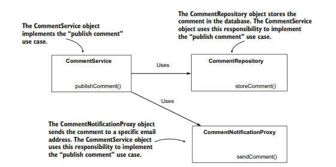

# Anotações

# Abstraction

A Abstração é um dos pilares da programação orientada a objetos, já que permite o desacoplamento. Em Spring, ela também é importante

## Usando Interfaces para definir contratos

Interface é uma estrutura abstrata que é utilizada para declarar uma responsabilidade específica, forçando todos os objetos que a implementam a definir essa responsabilidade.

### Interfaces para desacoplar implementações

Interfaces podem ajudar no desacoplamento de implementações ao limitar as delegações de responsabilidades a apenas definirem o que querem que aconteça, deixando o como para o objeto a quem foi delegado.

### Exemplo real sem uso de frameworks

Em um caso onde um app de gerenciamento de tarefas permite que os usuários deixem comentários em tarefas. Quando um usuário publica um comentário, ele é armazenado em um db e é enviado um email para um endereço configurado no app.

A escolha por implementar diretamente as classes CommentService (onde está as regras de negócio), CommentRepository (onde há o armazenamento no banco de dados) e CommentNotificationProxy (conexão com serviço externo para enviar o e-mail), torna o acoplamento alto, já que para cada novo tipo de armazenamento (diferentes dbs) ou novo serviço de envio de notificação (whatsapp por exemplo) seria necessário criar um novo objeto.

Sendo assim, é melhor organizar o repository do comentário, bem como o proxy de notificação externa como interfaces, permitindo que o service apenas deixe claro que quer que o comentário seja armazenado e que uma notificação seja enviada, sem se preocupar em como isso seria feito.

## Usando *dependency injection* com abstrações

Já observamos que o Spring consegue setar os valores dos Beans para classes concretas, mas o framework também consegue entender abstrações.

### Decidindo quais objetos devem fazer parte do contexto do String

Apenas objetos que possuem uma dependência ou é uma dependência devem ser inseridos no contexto do Spring. Adicionar objetos que não se envolvem em nenhum relacionamento pode adicionar complexidade sem necessidade ao código. Partindo dessa ideia, também não faz sentido definirmos uma interface como Bean, sendo que ela não possuiria objetos para o Spring controlar.

### Escolhendo dentro múltiplas implementações de uma abstração

Caso haja mais de um objeto que implemente uma abstração, e algum outro objeto tenha essa abstração como dependência, o Spring seleciona o objeto com base nas *annotations* `@Primary` e `@Qualify`, da mesma maneira que as classes concretas, conforme abordado no Cap 3 (Escolhendo dentre múltiplos Beans no Spring context).

### Focando nas responsabilidades do objeto com *stereotype annotations*

É possível explicitar para o Spring qual a responsabilidade do objeto quando definimos uma classe como Bean, como é o caso das *annotations* `@Service` e `@Repository` que, no exemplo anterior, ficariam assim:

