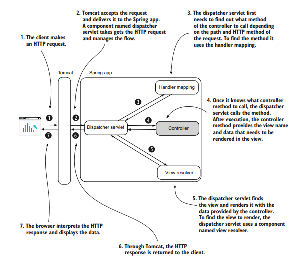

# Aplicativos web

## O que é um aplicativo web

Todo aplicativo que é acessado pelo web browser é um web app.

### Visão geral de um aplicativo web

Um aplicativo web é dividido em duas partes:

- Frontend: é a parte que o usuário interage. O web browser representa o frontend de um aplicativo web, enviando pedidos para o servidor web, recebe respostas e provê uma maneira do usuário interagir com a aplicação.
- Backend: é a parte que recebe os pedidos e retorna respostas contendo dados. O backend implementa lógica das regras de negócios e pode armazenar dados do usuário antes de enviar uma resposta.

### Diferentes modelos de implementação de um aplicativo web

Classificamos as maneiras de criar aplicativos web da seguinte maneira:

1. Aplicativos em que o backend provê uma view completa como resposta: O browser interpreta diretamente os dados recebidos e mostra as informações para o usuário.
2. Aplicativos que usam a separação frontend-backend: Nesses aplicativos o backend retorna dados crus, e o browser não os demonstra diretamente, ele executa um app frontend separadamente. Esse app processa os dados e diz para o browser o que mostrar.

É possível encontrar essas duas maneiras em aplicativos em produção. Entretanto, a separação em frontend-backend é considerada a maneira moderna de se construir um aplicativo web.

### Usando um contêiner servlet no desenvolvimento de aplicativos web

O browser (cliente) utiliza do protocolo HTTP para se comunicar com o servidor, entretanto, o Java não reconhece HTTP diretamente. Para permitir essa comunicação, utilizamos um *servlet container*, também conhecido como web server, que representa uma camada intermediária entre o aplicativo e o browser, tomando conta da comunicação. Um *servlet* nada mais é que um objeto Java controlado pelo *servlet container*, um exemplo muito utilizado de *servlet container* é o Tomcat.

## A magia do Spring Boot

Felizmente não é mais necessário configurar um *servlet container*, o Spring Boot faz isso automaticamente. Os recursos mais interessantes dessa ferramenta são:

- Simplifica a criação de projetos;
- Inicializador de dependências;
- Autoconfiguração baseada em dependências.

### Simplifica a criação de projetos

Torna possível a utilização de um inicializador de projeto para obter um esqueleto de aplicativo vazio, mas configurado.

### Inicializador de dependências

O Spring Boot agrupa certas dependências usadas com um propósito específico como dependências iniciais. Assim, não é necessário descobrir as dependências necessárias para um projeto com um propósito particular.
Antigamente era necessário definir todas as dependências de um aplicativo. Entretanto, com Spring Boot definimos um grupo de dependências, por exemplo o Spring Web, que será responsável por trazer todas as dependências em versões estáveis e compatíveis entre si.

### Autoconfiguração baseada em dependência

O Spring Boot aplica o princípio de convenção-sobre-configuração, ou seja, com base no propósito do aplicativo, representado pelas dependências utilizadas, o Spring define as configurações básicas, seguindo as maneiras mais utilizadas de configurar um app para os propósitos definidos. Isso faz ser necessário alterar apenas as configurações específicas que não condizem com suas necessidades.

Por exemplo, ao utilizar o Spring Starter Web, o Spring Boot já define uma instância do Tomcat acessível na porta 8080, já que se espera de um aplicativo web a capacidade de comunicar via HTTP.

## Implementando um web app com Spring MVC

Com o Spring Boot, começamos com um aplicativo bem configurado, mas vazio. Para criar uma página web é necessário dois passos:

1. Escrever um documento HTML com conteúdo que será mostrado ao cliente.
2. Escrever um controller com uma ação para a página web criada no ponto 1.

Um *controller* é um componente web que contém métodos (comumente chamado de ações) executados em uma requisição HTTP específica.

Para definir uma classe como controller, utilizamos a *stereotype annotation* `@Controller`. Isso também faz com que o Spring crie um bean da classe. Para definir que uma ação seja executada ao usuário entrar em uma rota específica, utilizamos a *annotation* `@RequestMapping` especificando a rota como parâmetro, por exemplo: `@RequestMapping("/home")`. Um exemplo seria:

```java
@Controller
public class MainController {
	@RequestMapping("/home")
	public String home() {
		return "home.html";
	}
}
```

Sendo assim, ao acessar a página [localhost:8080/home](http://localhost:8080/home) o método `home()` é executado, retornando o documento home.html. Entretanto, para isso acontecer, são necessários sete passos por trás dos panos:

1. O cliente faz uma requisição HTTP.
2. Tomcat pega essa requisição e chama um *servlet component*, no caso do Spring MVC, *o dispatcher servlet*.
3. O *dispatcher servlet* é o ponto de entrada para o aplicativo; Sua responsabilidade é gerenciar a requisição dentro do Spring. Ele deve encontrar qual ação do *controller* executar e enviar de volta uma resposta.
4. Para saber qual ação do *controller* executar, o *dispatcher servlet* delega ao componente *handler mapping*, que procura pela ação associada pela annotation `@RequestMapping`.
5. Após encontrar a ação, o *dispatcher* a executa, que retorna o nome da view. Se não foi possível encontrar nenhuma, ele retorna um erro 404 Not Found.
6. Agora o *dispatcher* precisa encontrar a view dentro dos conteúdos e enviar a reposta ao cliente. Para isso, ele delega a responsabilidade ao componente *View Resolver*.
7. Após encontrar, o *dispatcher* retorna a view renderizada através da resposta HTTP.

